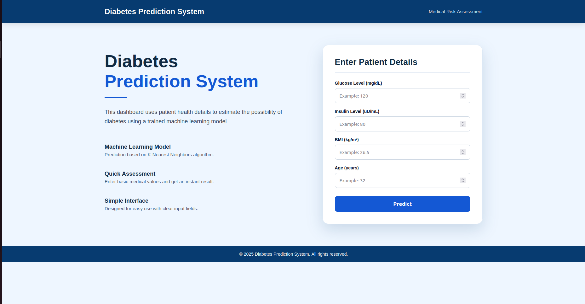
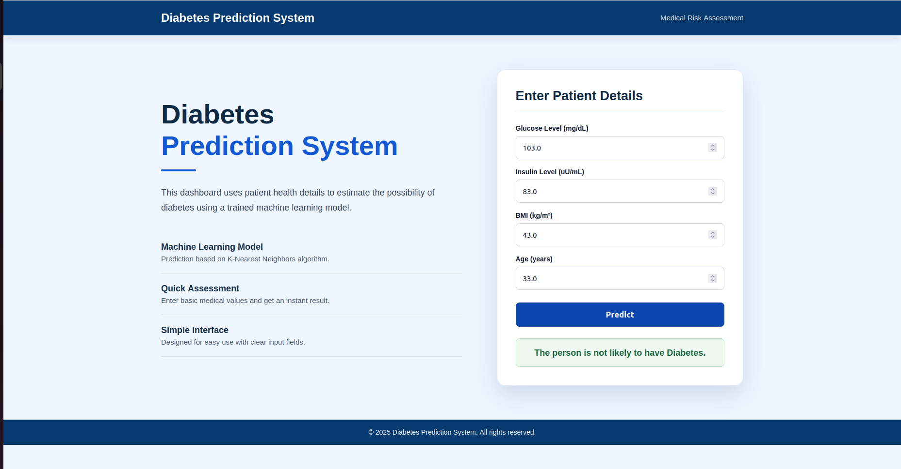
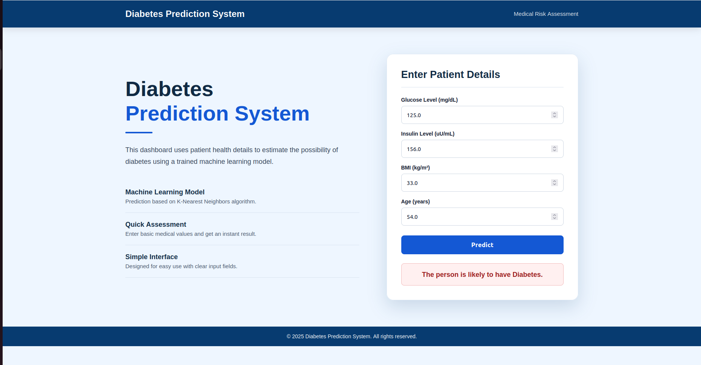

# 🩺 Diabetes Prediction System


---

## 📌 Project Overview

**Diabetes Prediction System** is a Flask-based Machine Learning web application that predicts whether a person is likely to have diabetes or not based on basic patient health parameters.

The system takes medical input values from the user, processes them using a trained machine learning model, and displays the prediction result instantly through a clean and professional web interface.

This project is built to demonstrate the practical implementation of Machine Learning in healthcare-based prediction systems.

---

## 🌐 Live Demo

🔗 **Live Project Link:**  
👉 [Click Here to View Live Project](https://diabetes-prediction-git-main-aryan-gupta-projects2.vercel.app/)

---

## ✨ Key Features

✅ Professional and clean user interface  
✅ Flask-based Machine Learning web application  
✅ Predicts diabetes possibility using patient health details  
✅ Uses trained ML model saved with Pickle  
✅ Uses scaler for proper feature transformation  
✅ Instant prediction result after form submission  
✅ Input values remain visible after prediction  
✅ Separate messages for diabetic and non-diabetic predictions  
✅ Responsive and simple dashboard layout  
✅ Successfully deployed on Vercel  
✅ Beginner-friendly project structure

---

## 🧠 Machine Learning Model

The project uses a trained **K-Nearest Neighbors Classifier** for diabetes prediction.

The model was trained using selected health-related input features. These features are scaled before prediction using a saved scaler file.

### 🔢 Input Features Used

| Feature       | Description                        |
| ------------- | ---------------------------------- |
| Glucose Level | Blood glucose level of the patient |
| Insulin Level | Insulin level of the patient       |
| BMI           | Body Mass Index of the patient     |
| Age           | Age of the patient                 |

### 🎯 Prediction Output

The system gives one of the following results:

✅ **The person is not likely to have Diabetes.**

or

⚠️ **The person is likely to have Diabetes.**

---

## 🛠️ Tech Stack Used

| Technology   | Purpose                                |
| ------------ | -------------------------------------- |
| Python       | Main programming language              |
| Flask        | Backend web framework                  |
| HTML5        | Structure of web pages                 |
| CSS3         | Styling and layout                     |
| Pandas       | Data handling                          |
| NumPy        | Numerical operations                   |
| Scikit-learn | Machine Learning model                 |
| Pickle       | Saving and loading model/scaler        |
| Gunicorn     | Production server support              |
| GitHub       | Version control and repository hosting |
| Vercel       | Project deployment                     |

---

## 📁 Project Structure

```bash
diabetes-prediction/
│
├── screenshots/
│   ├── home-page.png
│   ├── non-diabetic-result.png
│   └── diabetic-result.png
│
├── static/
│   └── style.css
│
├── templates/
│   └── index.html
│
├── app.py
├── model.pkl
├── scaler.pkl
├── diabetes.csv
├── Diabetes.ipynb
├── requirements.txt
├── vercel.json
├── Procfile
├── .gitignore
└── README.md
```

---

## ⚙️ Installation and Setup

Follow the steps below to run this project locally on your system.

### 1️⃣ Clone the Repository

```bash
git clone https://github.com/aryanheree/diabetes-prediction.git
```

### 2️⃣ Move into the Project Directory

```bash
cd diabetes-prediction
```

### 3️⃣ Create a Virtual Environment

```bash
python3 -m venv venv
```

### 4️⃣ Activate the Virtual Environment

For Linux / Mac:

```bash
source venv/bin/activate
```

For Windows:

```bash
venv\Scripts\activate
```

### 5️⃣ Install Required Libraries

```bash
pip install -r requirements.txt
```

### 6️⃣ Run the Flask Application

```bash
python app.py
```

### 7️⃣ Open the Project in Browser

```bash
http://127.0.0.1:5000/
```

---

## 📦 Requirements

The project uses the following dependencies:

```txt
Flask==3.0.3
numpy==1.26.4
pandas==2.2.2
scikit-learn==1.4.2
gunicorn==22.0.0
```

---

## 🚀 Deployment

This project is deployed on **Vercel**.

### Deployment Platform

```txt
Vercel
```

### Deployment Link

```txt
https://diabetes-prediction-git-main-aryan-gupta-projects2.vercel.app/
```

### Important Deployment Files

```bash
app.py
model.pkl
scaler.pkl
requirements.txt
vercel.json
templates/
static/
```

### vercel.json Configuration

```json
{
  "rewrites": [
    {
      "source": "/(.*)",
      "destination": "/app.py"
    }
  ]
}
```

---

## 🧪 Example Test Cases

You can test the deployed project using the following sample values.

### ✅ Example 1: Non-Diabetic Prediction

```txt
Glucose Level: 103
Insulin Level: 83
BMI: 43
Age: 33
```

Expected Result:

```txt
The person is not likely to have Diabetes.
```

### ⚠️ Example 2: Diabetic Prediction

```txt
Glucose Level: 125
Insulin Level: 156
BMI: 33
Age: 54
```

Expected Result:

```txt
The person is likely to have Diabetes.
```

---

## 📊 Project Workflow

```bash
1. Load diabetes dataset
2. Understand the dataset
3. Select useful input features
4. Preprocess the data
5. Apply feature scaling
6. Train Machine Learning model
7. Save trained model using Pickle
8. Save scaler using Pickle
9. Build Flask web application
10. Design frontend using HTML and CSS
11. Connect Flask app with ML model
12. Test prediction system locally
13. Push project to GitHub
14. Deploy project on Vercel
```

---

## 📸 Project Screenshots

### 🏠 Home Page



---

### ✅ Non-Diabetic Prediction Result



---

### ⚠️ Diabetic Prediction Result



---

## 🖼️ How to Add Screenshots

Create a folder named `screenshots` in your project root.

```bash
mkdir screenshots
```

Save your screenshots inside the folder with these exact names:

```bash
home-page.png
non-diabetic-result.png
diabetic-result.png
```

Then push the screenshots to GitHub:

```bash
git add README.md screenshots/
git commit -m "Add README with project screenshots"
git push
```

---

## 🔮 Future Improvements

🚀 Add more medical input parameters  
🚀 Improve model accuracy using advanced algorithms  
🚀 Add data visualization charts  
🚀 Add patient report download feature  
🚀 Add database support for storing prediction history  
🚀 Add authentication system for users/admin  
🚀 Add doctor recommendation section  
🚀 Improve UI with more healthcare-themed visuals

---

## ⚠️ Disclaimer

This project is created for **educational and learning purposes only**.

The prediction result should not be considered as professional medical advice. Always consult a qualified doctor or healthcare professional for real medical diagnosis and treatment.

---

## 👨‍💻 Author

**Aryan Gupta**

🔗 GitHub: [aryanheree](https://github.com/aryanheree)

---

## 📌 Project Status

✅ Machine Learning Model Trained  
✅ Flask Web App Created  
✅ Frontend Designed  
✅ Model Integrated with Dashboard  
✅ GitHub Repository Created  
✅ Project Successfully Deployed on Vercel  
✅ Project Completed

---

## ⭐ Support

If you like this project, please consider giving it a ⭐ on GitHub.

---
